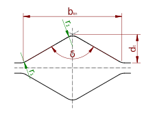
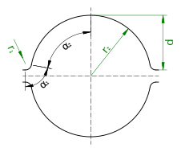
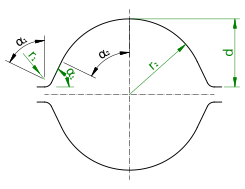

## The Generalized Groove

All elongation grooves can be traced back to a generalized elongation groove consisting of two straights and four radii.
The geometry of this is shown below.


All geometric key values like cross-sections and perimeters can be calculated on this generalized groove. The
generalized groove is implemented in the `GrooveBase` class, all special groove types are derived from that.

In the following the measures of the groove are listed, their names are used in source code and throughout the
documentation. The radii and angles are numbered from outside to inside.

| Symbol            | Description                              |
|-------------------|------------------------------------------|
| $r$               | Radius                                   |
| $\alpha$          | Angle corresponding to a radius          |
| $\beta$, $\gamma$ | Angles useful for coordinate calculation |
| $b_d$             | Ground width                             |
| $b_d'$            | Even ground width                        |
| $b_\mathrm{ks}$   | Tip width                                |
| $b_\mathrm{kn}$   | Usable width                             |
| $d$               | Depth                                    |
| $i$               | Indent                                   |
| $s$               | Roll gap                                 |

The coordinates of the points 1 to 12 shown in the figure can be calculated as follows, where the angles $\beta =
\alpha_4 - \alpha_3 / 2$ and $\gamma = \frac{\pi}{2} - \alpha_2 - \alpha_3 + \alpha_4$.

| number | z                                                                                  | y                                                                                  |
|--------|------------------------------------------------------------------------------------|------------------------------------------------------------------------------------|
| 1      | $z_2 + r_1 \tan \frac{\alpha_2}{2}$                                                | $0$                                                                                |
| 2      | $\frac{b_{kn}}{2}$                                                                 | $0$                                                                                |
| 3      | $z_1 - r_1 \sin \alpha_1$                                                          | $r_1 \left( 1 - \cos \alpha_1 \right)$                                             |
| 4      | $z_{11} + r_2 \cos \gamma$                                                         | $y_{11} + r_2 \sin \gamma$                                                         |
| 5      | $z_{10} + r_3 \sin \left( \frac{\alpha_3}{2} - \beta \right)$                      | $y_{10} + r_3 \cos \frac{\alpha_3}{2}$                                             |
| 6      | $z_8 + r_4 \sin \alpha_4$                                                          | $y_8 - r_4 \sin \alpha_4$                                                          |
| 7      | $\frac{b_d'}{2}$                                                                   | $d - i$                                                                            |
| 8      | $\frac{b_d'}{2}$                                                                   | $y_7 + r_4$                                                                        |
| 9      | $0$                                                                                | $y_7$                                                                              |
| 10     | $z_6 + r_3 \sin \left( \frac{\alpha_3}{2} + \beta \right)$                         | $y_6 + r_3 \cos \left( \frac{\alpha_3}{2} + \beta \right)$                         |
| 11     | $z_{10} + \left( r_3 - r_2 \right) \sin \left( \frac{\alpha_3}{2} - \beta \right)$ | $y_{10} + \left( r_3 - r_2 \right) \cos \left( \frac{\alpha_3}{2} - \beta \right)$ |
| 12     | $z_1$                                                                              | $r_1$                                                                              |

However, in the current implementation the term "groove" is more narrow. From now on, the term should represent only the
shape machined into the roll surface. Therefore, the roll gap $s$ is no measure of the groove itself but of
the [`RollPass`](units.md#roll-passes). Also, the tip width $b_\mathrm{kn}$ is not inherent to the groove, since it
depends on the roll gap.

## Diamond-like grooves

### The `DiamondGroove` class

The `DiamondGroove` class represents a rhombus shaped groove as shown in the figure.



Mandatory measures of this groove are the two radii $r_1$ and $r_2$. To constrain geometry fully, any two of the
following must be given:

- usable width $b_\mathrm{kn}$
- tip depth $d_\mathrm{t}$
- tip angle $\delta$

So the constructor has the following signature:

    DiamondGroove(r1, r2, usable_width, tip_depth, tip_angle)

The radii are typically small, the depth is $d_\mathrm{t}$ typically $< \frac{b_\mathrm{kn}}{2}$ so that the tip angle
$\delta$ is larger than 90°.

$r_3$ and $r_4$ are considered to be zero, as well as $b_d$ and $b_d'$.

The tip depth $d_\mathrm{t}$ was chosen in favor of the real depth $d$, because it does not change, when the radii are
modified. So the overall geometry remains the same if one modifies only the radii. The tip depth can be considered as
the diagonal of the rhombus with sharp corners.

### The `SquareGroove` class

The `SquareGroove` class represents a square shaped groove as shown in the figure.


Mandatory measures of this groove are the two radii $r_1$ and $r_2$. To constrain geometry fully, any two of the
following must be given:

- usable width $b_\mathrm{kn}$
- tip depth $d_\mathrm{t}$
- tip angle $\delta$

So the constructor has the following signature:

    SquareGroove(r1, r2, usable_width, tip_depth, tip_angle)

The radii are typically small, the depth is $d_\mathrm{t}$ typically $\approx \frac{b_\mathrm{kn}}{2}$. The tip angle
$\delta$ is typically a one or two degree larger than 90° for wear reasons.

$r_3$ and $r_4$ are considered to be zero, as well as $b_d$ and $b_d'$.

The tip depth $d_\mathrm{t}$ was chosen in favor of the real depth $d$, because it does not change, when the radii are
modified. So the overall geometry remains the same if one modifies only the radii. The tip depth can be considered as
the diagonal of the square with sharp corners.

The constructor will raise a warning, if the tip angle significantly deviates from 90°, consider to use
a [`DiamondGroove`](#the-diamondgroove-class) instead.

## Round-like Grooves

### The `RoundGroove` class

The `RoundGroove` class represents a groove with a circular cross-section as shown in the figure.



It is defined by two radii $r_1$ and $r_2$ and the depth $d$, so the constructor has the following signature:

    RoundGroove(r1, r2, depth)

The geometric constraints are $r_1 << r_2$ and $d < r_2$.

$r_3$ and $r_4$ are considered to be zero, as well as $b_d$ and $b_d'$.

The angles can be calculated as following:

$$ \alpha_1 = \alpha_2 = \arccos \left( 1 - \frac{d}{r_1 + r_2} \right)
$$

The usable width is then:

$$ b_\mathrm{kn} = 2 \left( r_1 \sin \alpha_1 + r2 \sin \alpha_2 - r_1 \tan \frac{\alpha_1}{2} \right)
$$

### The `FalseRoundGroove` class

The `FalseRoundGroove` class represents a groove with a roughly circular cross-section, which shows a small straight
flank, as shown in the figure.



It is defined by two radii $r_1$ and $r_2$, the depth $d$ and the flank angle $\alpha_1$ , so the constructor has the
following signature:

    FalseRoundGroove(r1, r2, depth, flank_angle)

The geometric constraints are $r_1 << r_2$, $d < r_2$ and $\alpha_1 < 90°$ .

$r_3$ and $r_4$ are considered to be zero, as well as $b_d$ and $b_d'$.

The usable width can be calculated as:

$$ b_\mathrm{kn} = 2 \frac{d + \frac{r_2}{\cos \alpha_1} - r_2}{\tan \alpha_1} $$

## Oval-like Grooves

### The `CircularOvalGroove` class

The `CircularOvalGroove` class represents an oval shaped groove consisting of two radii as shown in the figure.


It is defined by two radii $r_1$ and $r_2$ and the depth $d$, so the constructor has the following signature:

    CircularOvalGroove(r1, r2, depth)

The geometric constraints are $r_1 << r_2$ and $d << r_2$.

$r_3$ and $r_4$ are considered to be zero, as well as $b_d$ and $b_d'$.

The topology of this groove is similar to the [`RoundGroove`](#the-roundgroove-class), with the main difference, that
the center of $r_2$ is not placed in the center of the groove. For this reason $d$ is typically much smaller than $`r_2`
$.

### The `FlatOvalGroove` class

The `FlatOvalGroove` class represents an oval shaped groove consisting of two radii and an even ground as shown in the
figure.


Mandatory measures of this groove are the two radii $r_1$ and $r_2$, as well as the depth $d$ and the usable width $b_
\mathrm{kn}$.

So the constructor has the following signature:

    FlatOvalGroove(r1, r2, depth, usable_width)

The depth is $d$ typically $\le \frac{b_\mathrm{kn}}{2}$.

$r_3$ and $r_4$ are considered to be zero.

## Reference of Groove Classes

```{eval-rst}
.. automodule:: pyroll.core.grooves
    :members:
    :imported-members:
```